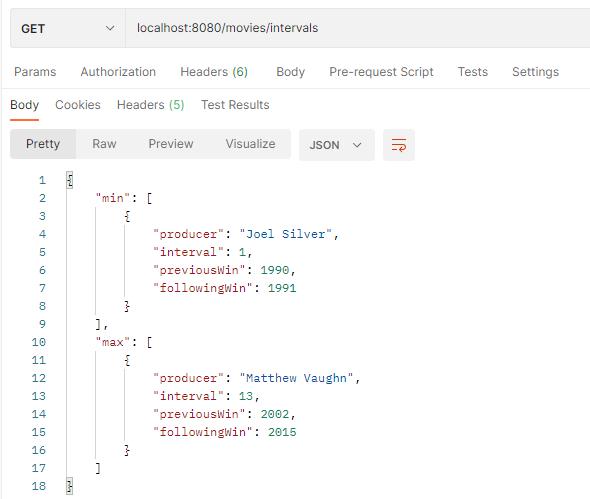

# Worst Movie API
API RESTful that reads a list of the winners and nominees from the Worst Movie category of the Golden Raspberry Awards.


## Installation and Run

Clone the project

```bash
  git clone https://github.com/lcosbr/worstmovie
```

Go to the project directory

```bash
  cd worstmovie
```

Install dependencies

```bash
  mvn clean install
```

Start the server

```bash
  mvnw spring-boot:run
```


## API Reference

#### Get the producer with the bigger interval and with the lower interval between two consecutive awards.

Running on default port: 8080

```http localhost
  GET /interval
```

## Running Tests

To run the integration tests, run the following command

```bash
  mvn clean test
```


## Features

- Read from CSV file
- Implemented using level 2 of Richardson Maturity 
- Created Integration Tests
- Using H2 Database Engine 


## Test Specification

[Backend Specification](https://github.com/lcosbr/worstmovie/blob/master/Especifica%C3%A7%C3%A3o%20Backend.pdf)


## Screenshots

### Request


## Authors

- [Lucas Oliveira](https://www.github.com/lcosbr)